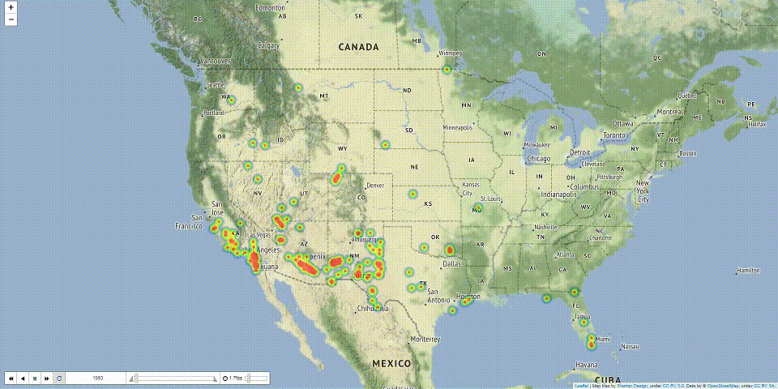

# Taming Of 1.88 Million Wildfires
Analysis of 1.88 Million US Wildfires-dataset on kaggle.

This is the corresponding repository to this [Medium article](https://medium.com/@martin_47009/taiming-1-88-million-wildfires-e2595c43b769).

Following questions are analyzed:
1. Which state is the moste fire prone?
2. How does the evolution look like and is there a trend?
3. Are there seasonal fluctuations? / Wildfires have to occure much more often in summer, haven't they?
4. Can we predict the size / area of a fire?

Make sure you've seen these visualizations:

- [Static heatmap of incidents](https://mar-su.github.io/taming-of-188-million-wildfires/figures/overall_fire-size-over-1800.html)
- [Heatmap of incidents over time](https://mar-su.github.io/taming-of-188-million-wildfires/figures/evolution_fire-size-over-1500.html)

# Getting started
Set up the environment with [Anaconda](anaconda.org):
```
conda env create --file environment.yml
```
Once this is done, you can start your environment with:
```
conda activate wildfires
```
And start `jupyter` with `jupyter notebook`.

Download the SQLite-database `FPA_FOD_20170508.sqlite` from the kaggle-repository [here](https://www.kaggle.com/rtatman/188-million-us-wildfires).

# Structure
You can find two notebooks in this project.
* `Taming Of 1.88 Million Wildfires.ipynb` will provide concise answers to the questions above.
* `EDA.ipynb` provides additional insights and can be seen as home for experiments.
* Files in `figures` are plots used for the [Medium article]().
* Files in `html` are HTML versions of the notebook(s).
* `environment.yml` defines the anaconda environment as written above.

# Findings
As concise report, the [Medium article](https://medium.com/@martin_47009/taiming-1-88-million-wildfires-e2595c43b769) is recommended, but here's a short summary.
Following questions are analyzed:
1. Which state is the moste fire prone?
  - Alaska in terms of area and California in terms of frequency.
2. How does the evolution look like and is there a trend?
  - Fires seem to get larger.
3. Are there seasonal fluctuations? / Wildfires have to occure much more often in summer, haven't they?
  - In mid of June to mid of September the frequency and the area has peaks.
4. Can we predict the size / area of a fire?
  - A linear regression with an R²-score of 0.4122 on the test set can be obtained.


**Have fun!**
